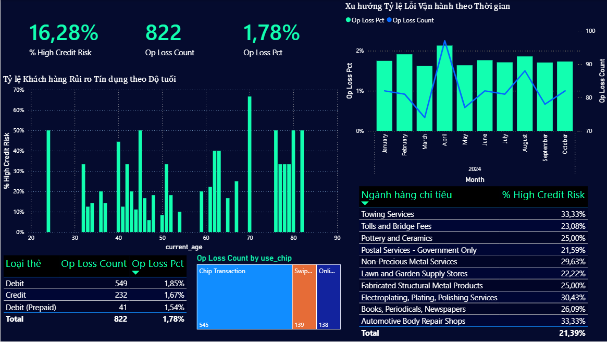

# 🏦 Hệ thống Phân tích & Quản trị Rủi ro Ngân hàng Bán lẻ (SQL Analytics)

## 📌 Tổng quan Dự án
Dự án ứng dụng SQL Server (T-SQL) xử lý cơ sở dữ liệu hệ thống ngân hàng bán lẻ nhằm thiết lập các mô hình tầm soát, đo lường và cảnh báo sớm các danh mục rủi ro cốt lõi bao gồm: **Rủi ro Tín dụng (Credit Risk)**, **Rủi ro Gian lận (Fraud Risk)**, và **Rủi ro Vận hành (Operational Risk)**.

---

## 📊 1. Quản trị Rủi ro Tín dụng (Credit Risk)
Phân lớp tệp khách hàng theo thang điểm tín dụng chuẩn FICO nhằm quản lý chất lượng danh mục cho vay và dự báo nguy cơ nợ xấu tiềm ẩn.
* **Mã nguồn xử lý:** `01_credit_risk.sql`
* **Kết quả phân tích thực tế:**

| Mức độ rủi ro | Tổng số khách hàng | Tỷ lệ phần trăm | Biện pháp ứng phó (Risk Mitigation) |
| :--- | :---: | :---: | :--- |
| 1. Exceptional (Rủi ro cực thấp) | 166 | 8.30% | Ưu tiên cấp hạn mức cao, áp dụng lãi suất ưu đãi. |
| 2. Very Good (Rủi ro thấp) | 474 | 23.70% | Duy trì chính sách chăm sóc tiêu chuẩn. |
| 3. Good (Rủi ro trung bình) | 931 | 46.55% | Theo dõi định kỳ, kiểm soát tỷ lệ sử dụng hạn mức. |
| 4. Fair (Rủi ro cao) | 348 | 17.40% | Thắt chặt điều kiện gia hạn, hạn chế tăng hạn mức. |
| 5. Poor (Rủi ro rất cao) | 81 | 4.05% | Đưa vào danh sách giám sát đặc biệt, chuẩn bị trích lập dự phòng. |

---

## 🛡️ 2. Hệ thống Cảnh báo sớm Gian lận Giao dịch (Fraud Risk)
Tầm soát hành vi gian lận thẻ (nhân bản thẻ, hack tài khoản) bằng kỹ thuật Self-Join để phát hiện các giao dịch phát sinh bất thường tại nhiều khu vực địa lý khác nhau trong chu kỳ ngắn (24 giờ).
* **Mã nguồn xử lý:** `02_fraud_detection.sql`
* **Kết quả phân tích thực tế:** Hệ thống đã sàng lọc và gắn cờ cảnh báo thành công **2,030 tín hiệu giao dịch nghi vấn** có hành vi quẹt thẻ ở từ 2 bang khác nhau trở lên trong 24h. Điển hình phát hiện tài khoản `card_id = 19` phát sinh giao dịch tại bang Kansas (Mỹ) và tiếp tục phát sinh giao dịch tại Italy trong cùng một ngày.

---

## ⚙️ 3. Kiểm soát Tổn thất Vận hành (Operational Risk)
Đo lường hiệu suất xử lý luồng giao dịch, bóc tách tỷ lệ giao dịch bất thường (lỗi hệ thống, hoàn tiền, số tiền $\le 0$) theo từng dòng sản phẩm thẻ để tối ưu hóa quy trình kiểm soát vận hành nội bộ.
* **Mã nguồn xử lý:** `03_operational_risk.sql`
* **Kết quả phân tích thực tế:**

| Dòng sản phẩm thẻ (Card Type) | Tổng số giao dịch | Số giao dịch bất thường | Tỷ lệ lỗi vận hành (Pct) |
| :--- | :---: | :---: | :---: |
| Credit | 48,072 | 2,598 | 5.40% |
| Debit | 100,027 | 5,370 | 5.37% |
| Debit (Prepaid) | 9,125 | 337 | 3.69% |

---

## 🛠️ Công cụ & Kỹ thuật ứng dụng
* **Hệ quản trị:** SQL Server (SSMS / T-SQL).
* **Kỹ thuật SQL nâng cao:** Common Table Expressions (CTE), Window Functions (`SUM OVER`), Self-Join, DateTime Functions (`DATEDIFF`), Conditional Aggregation (`CASE WHEN`).
* * **Công cụ trực quan hóa:** Power BI Desktop.
* **Kỹ thuật Power BI nâng cao:**
  - **Data Modeling (Mô hình hóa dữ liệu):** Thiết kế mô hình Star Schema chuẩn chỉnh, tối ưu hóa mối quan hệ giữa các bảng Dimension (`banking users`, `banking cards`, `banking mcc_codes`) và Fact table (`banking transactions`).
  - **Định hướng bộ lọc (Cross-filtering):** Cấu hình bộ lọc hai chiều (Both-directional filtering) giúp đồng bộ dữ liệu chuẩn xác giữa danh mục ngành hàng và các chỉ số đo lường rủi ro.
  - **Ngôn ngữ DAX:** Viết các Measure tính toán động để đo lường hiệu suất và tỷ lệ rủi ro (Ví dụ: `% High Credit Risk`, `Op Loss Count`, `Op Loss Pct`).
  - **UI/UX Dashboard:** Áp dụng tư duy thiết kế Grid Layout trên nền tối (Dark Theme), kết hợp linh hoạt giữa các dạng đồ thị trực quan (Trục kép, Treemap) và các bảng dữ liệu nâng cao (Top 10 ngành hàng nguy cơ).

